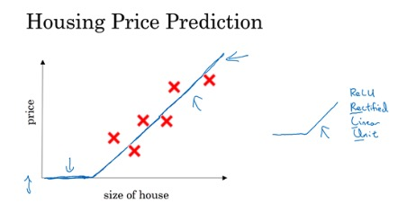
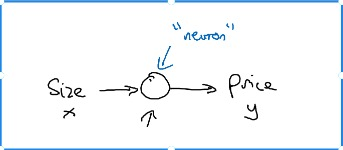

# What is neural network?

It is a powerful learning algorithm inspired by how the brain works.

## Example 1 -- single neural network

Given data about the size of houses on the real estate market and you want to fit a function that will
predict their price. It is a linear regression problem because the price as a function of size is a 
continuous output.

We know the prices can never be negative so we are creating a function called Rectified Linear Unit(ReLU)
(纠正线性单元)which starts at zero.

The input is the size of the house(x)

The output is the price(y)

The "neuron" implements the function ReUL(blue line)

## Example 2 -- Multiple neural network

The price of a house can be affected by other features such as size, number of bedrooms, zip code and wealth.
The role of the neural network is to predicted the price and it will automatically generate the hidden units.
We only need to give the inputs x and the output y.

