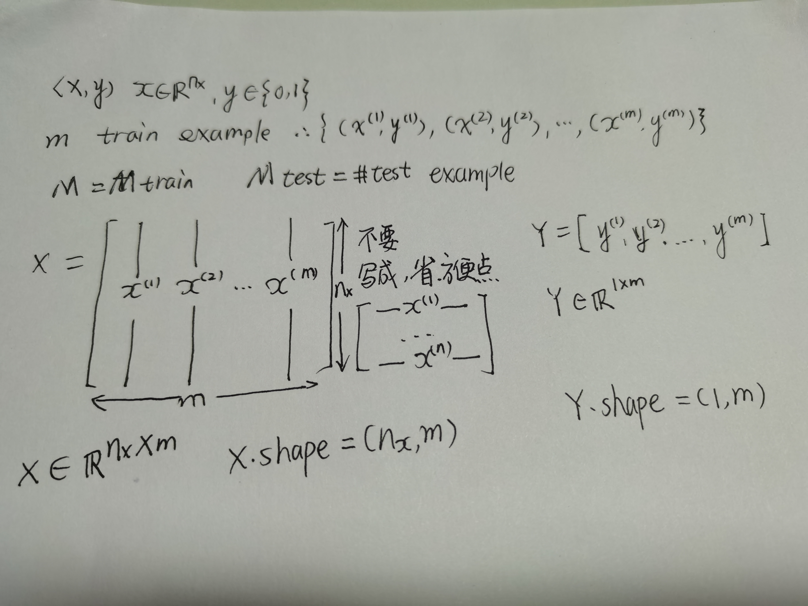

# Binary Classification

In a binary classification problem, the result is a discrete value output.

For example 

- account hecked (1) or compromised (0)
- a tumor malign (1) or benign(0)

### Example: Cat vs Non-Cat

The goal is to train a classifier that the input is an image represented by a feature vector, x, and predicts
whether the corresponding label y is 1 or 0. In this case, whether this is a cat image (1) or a non-cat image(0).

An image is store in the computer in three seperate matrices corresponding to Red, Green, and Blue color channels 
of the image. The three matices have the same size as the image, for example, the resolution of the cat image us 
64 pixels X 64 pixel, the three matrices(RGB) are 64 X 64 each.

The value in a cell represents the pixel intensity which will be used to create a feature vector of n-dimension.
In pattern recognition and machine learning, a feature vector represents an object, in this case, a cat or no cat.

To create a feature vector, x, the pixel intensity values will be "unroll" or "reshape" for each color. The dimension
of the input feature vector x is nx = 64 X 64 X 3 = 12288.

x = $$
 \left[
 \begin{matrix}
   255  \\
   231  \\
   42   \\
   .    \\
   .    \\
   .    \\
   255  \\
   134  \\
   202  \\
   .    \\
   .    \\
   .    \\
   255  \\
   134  \\
   93   \\
   .    \\
   .    \\
   .    
  \end{matrix}
  \right] \tag{3}
$$

Reference：
https://blog.csdn.net/nuoyanli/article/details/96179976